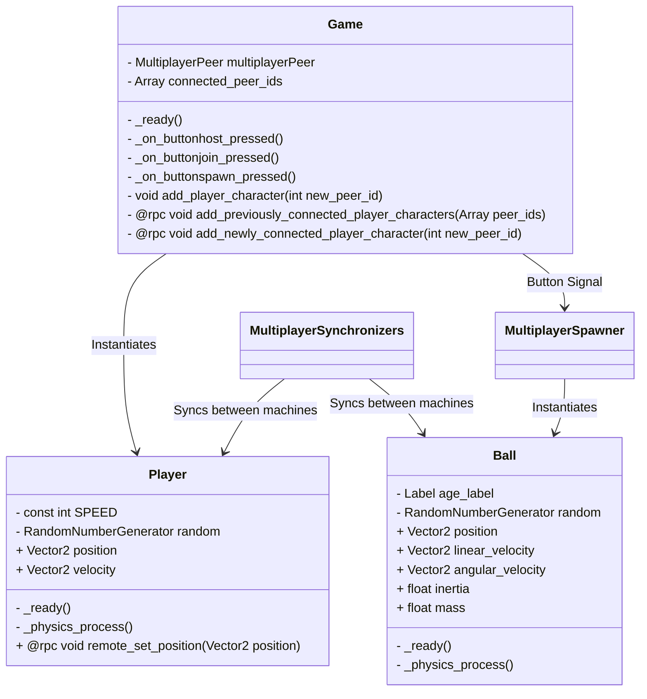

# team-wii-tanks-godot-4-networking
Godot 4.0 introduced new tools to synchronize instances of a multiplayer game. 
This repository is to test the new additions and develop a system ready to integrate into the base game.

## UML Diagram

